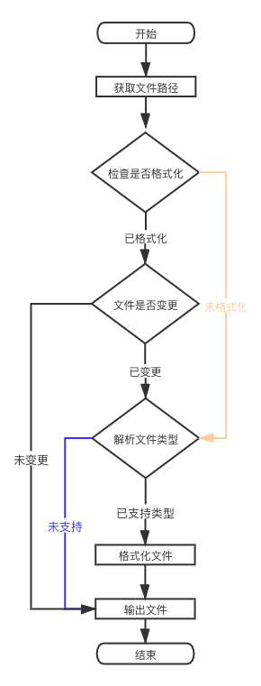

# Code Format Plugin

## Install
---
```Console
$ npm install ksr-cfp
```

## Usage
---
> prettier requires at least version <span style="color:#ecda7a;font-size:16px">10.13.0</span> of Node
 
```Console
$ ksr-cfp -d FilePath -p .prettierrc.json -c true 
```

## Options
---
| Param | Required |  Default | Alias| Introduce
| :---: | :---: | :---:| :---:| :---:|
| -d | false | . | --directory | File Path|
| -p | false || -path| --find-config-path and --config  |
| -c | false | false | --cli | excute CLI |                     

<br/>

## Format Configuration Schema
---
```Json
{
  "parser": "babel",
  "printWidth": 120, 
  "semi": true, 
  "singleQuote": true,
  "pugAttributeSeparator":"always",
  "pugClosingBracketPosition":"new-line",
  "pugCommentPreserveSpaces":"keep-all",
  "pugSortAttributes":"as-is",
  "tslintIntegration":"false" ,
  "stylelintIntegration" : "false",
  "arrowParens": "always",
  "bracketSpacing": true,
  "embeddedLanguageFormatting": "auto",
  "htmlWhitespaceSensitivity": "css",
  "insertPragma": false,
  "jsxBracketSameLine": false,
  "jsxSingleQuote": false,
  "proseWrap": "preserve",
  "quoteProps": "as-needed",
  "requirePragma": false,
  "tabWidth": 2,
  "trailingComma": "es5",
  "useTabs": false,
  "vueIndentScriptAndStyle": false
}
```

> 1、 [more options >> ](https://prettier.bootcss.com/docs/options.html)

> 2、[All Schema >>](http://json.schemastore.org/prettierrc)

## Support 
---
| File Suffix or Valid options| Plugin |
| :---: | :---| 
| `*`.pug| @prettier/plugin-pug| 
| `*`.ts|  @typescript-eslint/typescript-estree |
| `*`.css、`*`.scss、`*`.less| postcss-scss and postcss-less |
| `*`.json 、`*`.json5|  @babel/parser parseExpression |
|`*`.md |  remark-parse |
|`*`.html、`*`.vue 、`*`.ag(angular) |angular-html-parser|
|`*`.yaml| yaml and yaml-unist-parser |
|graphql| graphql/language |
| babel , babel-flow |  @babel/parser|
| babel-ts| typescript|
| flow | flow-parse |

<br/>

## Flow

